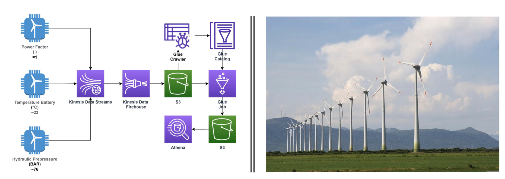

# Projeto2 - Aquisição e Disponibilização de Dados em Streaming de Sensores de Turbina Eólica (fictícios) em Ambiente AWS (AWS S3, AWS Kinesis, AWS Glue e AWS Athena)

>Projeto realizado juntamente ao curso de Formação em Engenharia de dados [2022] para consolidar conhecimento adquirido.
## Objetivos:
Este projeto tem como objetivo simular a aquisição de dados em tempo real (Streaming) de sensores instalados em uma turbina eólica e seu armazenamento e análise no ambiente AWS como descrito a seguir:

* Criação de produtores de informação que simulam os sensores de aquisição de dados de "Power Factor" (entre  0.7 e 1), "Battery Temperature" (entre 20 e 25 graus Celsius) e Hydraulic Pressure (entre 70 e 80 BAR). Utilizou-se da linguagem Python que gerou 1500 registros de cada sensor ao mesmo tempo com intervalo de 0.3 segundos através do Google Colab.

* Configuração do ambiente AWS Kinesis, que irá receber os dados gerado pelo Kinesis Data Stream e entregar esses dados ao bucket criado no AWS S3 através do Kinesis Data Firehouse.

* De posse dos dados, utilização do AWS Glue Catalog para geração de banco de dados, Glue Crawler para criação de tabela à partir dos dados no AWS S3 e Glue Job para descobrir os dados adquiridos e consolidar os dados em um datalake no AWS S3 e disponibilizar para consulta no AWS Athena através do AWS Glue (criar datalake de dados consolidados).

* De posse dos dados consolidados, é possível realizar análise com o AWS Athena (certificar de criar o datalake dos dados consolidados no AWS Glue) para que sejam feitas consultas e interpretação dos dados.

<!-- colocar screenshoot do seu projeto -->

## Arquivos de resolução

Os arquivos de resolução se encontram anexados. São eles: scripts Python no formato .ipynb que foram utilizados no Google Colab e arquivo .csv consolidando todos os 4500 dados aquisitados dos 3 sensores (1500 de cada).

_______
## Meta

Link do curso: <https://www.udemy.com/course/engenheiro-de-dados/>

Bruno Augusto Pinto --- [Linkedin](https://www.linkedin.com/in/brunoaugp/) --- brunoaugp@hotmail.com

Currículo online: <https://brunoaugp.github.io/>

